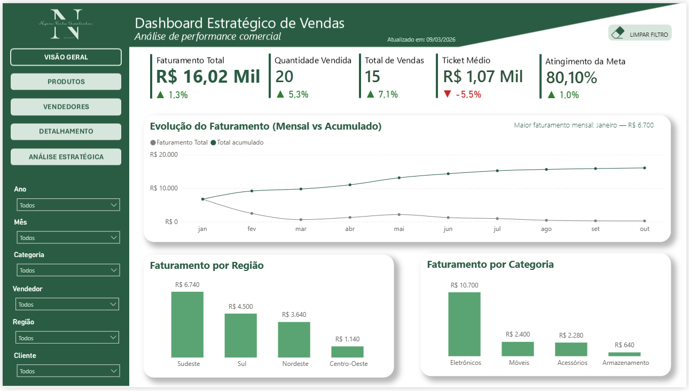

# 📊 Dashboard de Vendas

Este dashboard foi desenvolvido em **Power BI** com o objetivo de analisar dados de vendas e gerar **insights estratégicos que auxiliem na tomada de decisão comercial**.

O projeto simula um cenário real de análise de desempenho de vendas, utilizando dados estruturados e modelados para fins de estudo e desenvolvimento de portfólio em **Data Analytics e Business Intelligence**.

---

## 📸 Visão do Dashboard

Abaixo está uma das páginas do painel desenvolvida no Power BI.

O dashboard completo, contendo todas as páginas e análises desenvolvidas, pode ser acessado através do botão abaixo.

  

  

---

## 🚧 Status do Projeto

O dashboard encontra-se **em desenvolvimento**.  

Novas análises, visualizações e melhorias de design serão adicionadas conforme o projeto evolui.

---

## 🗄 Fonte dos Dados

Os dados utilizados neste dashboard foram **modelados e estruturados em SQL utilizando MySQL**.

Todo o processo de criação da base de dados — incluindo **modelagem do banco, criação das tabelas, relacionamentos e inserção de dados simulados** — foi desenvolvido no repositório abaixo:

➡️ https://github.com/nayararv/sql-analise-de-vendas

Neste projeto, o **Power BI foi conectado diretamente ao banco de dados MySQL**, permitindo que o dashboard consumisse os dados **diretamente das tabelas do banco**, mantendo assim a estrutura original da base criada em SQL.

Para facilitar a navegação e visualização dos dados por visitantes do repositório, também foram disponibilizadas cópias das tabelas em formato **CSV** na pasta **/data** deste projeto.

Esses arquivos permitem que qualquer pessoa possa **explorar rapidamente a estrutura dos dados utilizados no dashboard**, sem a necessidade de configurar o ambiente de banco de dados.

As tabelas disponibilizadas são:

- `vendas.csv`
- `clientes.csv`
- `produtos.csv`
- `vendedores.csv`
- `datas.csv`
- `meta_vendas.csv`

Essas tabelas seguem um **modelo dimensional utilizado em projetos de Business Intelligence**, com uma **tabela fato de vendas** e **tabelas dimensão de apoio para análise**.

---

## 🧩 Modelo de Dados

O projeto utiliza um **modelo dimensional (Star Schema)**, amplamente utilizado em projetos de Business Intelligence.

Estrutura do modelo:

Tabela Fato:
- `vendas.csv` → registro das transações de vendas

Tabelas Dimensão:
- `clientes.csv` → informações dos clientes
- `produtos.csv` → catálogo de produtos
- `vendedores.csv` → equipe comercial
- `datas.csv` → dimensão temporal

Tabela de apoio:
- `meta_vendas.csv` → metas comerciais utilizadas para cálculo de atingimento

---

## 📊 Indicadores de Performance (KPIs)

O dashboard monitora os seguintes indicadores estratégicos:

- **Faturamento Total**
- **Quantidade Vendida**
- **Total de Transações**
- **Ticket Médio**
- **Atingimento da Meta de Vendas**

Esses indicadores permitem avaliar rapidamente a performance comercial do negócio e acompanhar a evolução dos resultados ao longo do tempo.

---

## 📈 Objetivo do Dashboard

Apresentar análises visuais que permitam compreender o desempenho comercial através de indicadores como:

- **Faturamento total**
- **Quantidade de vendas realizadas**
- **Evolução das vendas ao longo do tempo**
- **Produtos com maior volume de vendas**
- **Desempenho dos vendedores**
- **Comparação entre vendas realizadas e metas comerciais**

Essas análises ajudam a identificar **padrões de comportamento, oportunidades de crescimento e possíveis pontos de atenção no negócio**.

---

## 🔎 Principais Insights Identificados

A partir da análise exploratória dos dados, foi possível identificar alguns padrões relevantes:

- A categoria **Eletrônicos** apresenta a maior concentração de faturamento do negócio.
- Existe forte concentração de vendas na **região Sudeste**, indicando oportunidade de expansão comercial em outras regiões.
- Alguns vendedores concentram grande parte do faturamento total, sugerindo dependência de poucos performers.
- O **ticket médio apresentou variação negativa** no período analisado, indicando possível redução no valor médio das vendas.

Esses insights podem orientar decisões estratégicas como expansão regional, diversificação de portfólio e estratégias de aumento de ticket médio.

---

## 🛠 Ferramentas Utilizadas

- **SQL (MySQL)** — criação e modelagem da base de dados  
- **Power BI** — construção do dashboard e visualizações  
- **DAX** — criação de métricas e indicadores analíticos  
- **GitHub** — versionamento e documentação do projeto

---

## 📌 Observação

Os dados utilizados neste projeto são **dados simulados**, criados com fins educacionais e para desenvolvimento de **portfólio profissional em análise de dados e business intelligence**.

---

# 👩‍💻 Autora

**Nayara Rocha Vasselechen**

Projeto desenvolvido para estudo e portfólio de **Análise de Dados**.
